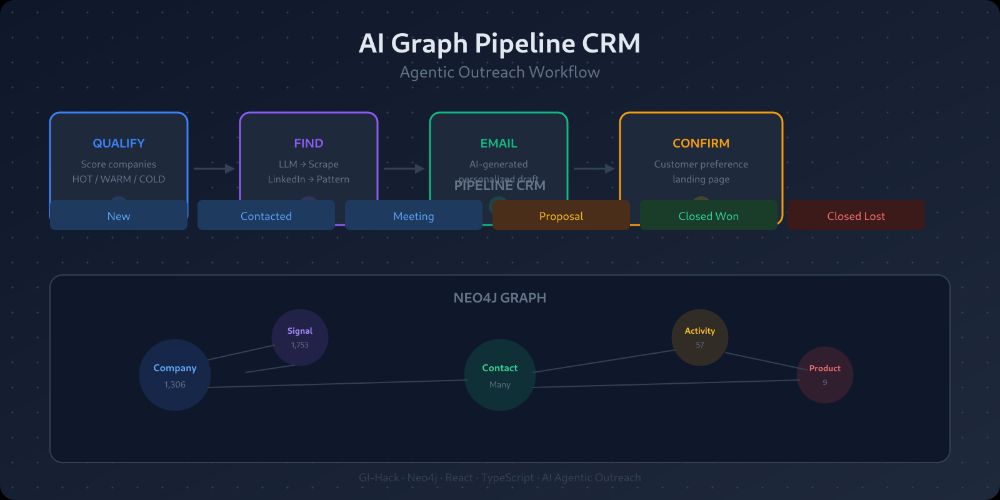

# LeadGraph — AI-Powered B2B Lead Identification

[](https://github.com/tobias-weiss-ai-xr/gi-hack/actions/workflows/ci.yml)
[](https://www.typescriptlang.org)
[](https://react.dev)
[](https://neo4j.com)



Built for the **StartMiUp Hackathon 2026** — Siemens Healthineers Challenge.

---

## What is LeadGraph?

**Problem:** Siemens Healthineers produces biological intermediates (proteins, antibodies, latex particles, blockers) at Marburg — but has no systematic way to identify diagnostic companies that buy these materials.

**Solution:** A Neo4j knowledge graph + AI lead scoring that scans 12+ public data sources for buying intent signals, ranks companies as HOT/WARM/COLD, and surfaces them for outreach.

**One-click deploy. Demo data loaded. Ready to evaluate.**

---

## Quick Start

```bash
# 1. Start Neo4j
docker compose up -d neo4j

# 2. Configure environment
cp .env.example .env
# Edit .env — add OPENAI_API_KEY (optional, for AI features)

# 3. Install dependencies
npm install

# 4. Build server
npm -w packages/server run build

# 5. Load demo pipeline data (10 leads, 57 activities)
npm run demo:pipeline

# 6. Start development
npm run dev
```

Open **http://localhost:5173** — client on :5173, server on :3001, Neo4j Browser on :7474.

---

## Tech Stack

| Layer | Technology |
|-------|-----------|
| Frontend | React 19 + Vite + TanStack Router + TanStack Query + Tailwind CSS v4 |
| Backend | Express + TypeScript (tsx watch) |
| Graph DB | Neo4j 5 Community + APOC (Docker) |
| AI | Vercel AI SDK (OpenAI, swappable) |

---

## Data

### Bootstrap Demo (fastest)

```bash
docker compose up -d neo4j
docker compose --profile bootstrap run bootstrap
```

Loads 1,306 companies, 1,753 signals, 3,456 relationships — scored and ready.

### Live Ingestion (fresh from APIs)

```bash
npm run ingest:seed  # Ontology + all adapters + score
```

| Source | Type | Signal |
|--------|------|--------|
| FDA 510(k) | REST API | FDA_CLEARANCE |
| GitHub | REST API | GITHUB_ACTIVITY |
| ClinicalTrials.gov | REST API | CLINICAL_TRIAL |
| OpenAlex | REST API | RESEARCH_PUBLICATION |
| DRKS (DE) | REST API | CLINICAL_TRIAL |
| EPO OPS (EP) | REST API | PATENT |
| MEDICA (DE) | Scrape | CONFERENCE |
| BMBF FÖKAT (DE) | CSV export | FUNDING |
| 4 stubs | Simulated | Various |

### Scoring Algorithm

```
Signal Score (0-40) + Product Fit (0-30) + Segment Bonus (0-20) + Recency Bonus (0-10)
→ Total (0-100) → Tier: HOT ≥ 70 / WARM ≥ 40 / COLD < 40
```

---

## API Reference

### Graph & Ingestion

| Method | Path | Description |
|--------|------|-------------|
| GET | `/api/health` | Server health |
| GET | `/api/graph/health` | Neo4j connectivity |
| POST | `/api/graph/seed` | Seed ontology |
| POST | `/api/graph/ingest` | Run ingestion (all or `?source=`) |
| GET | `/api/graph/score` | Score all prospects (HOT/WARM/COLD) |
| GET | `/api/graph/stats` | Node/relationship counts |
| POST | `/api/graph/query` | Execute arbitrary Cypher |

### Pipeline CRM

| Method | Path | Description |
|--------|------|-------------|
| GET | `/api/pipeline/leads` | All pipeline leads |
| POST | `/api/pipeline/start` | Start pipeline tracking |
| PUT | `/api/pipeline/:id/advance` | Advance to next stage |
| POST | `/api/pipeline/:id/activity` | Add activity note |

### AI

| Method | Path | Description |
|--------|------|-------------|
| POST | `/api/ai/enrich/:companyId` | AI enrichment (segment, domain) |
| POST | `/api/ai/outreach/:companyId` | Generate outreach email |
| GET | `/api/ai/explain/:companyId` | Score breakdown explanation |

---

## Project Structure

```
gi-hack/
├── packages/
│   ├── client/          # Vite + React + TanStack
│   ├── server/          # Express API
│   └── shared/          # TypeScript types
├── docker-compose.yml   # Neo4j service
└── docs/                # Architecture, specs, designs
```

---

## Architecture & Scoring Design

- [**Architecture Diagram**](docs/ARCHITECTURE.md) — Full system design, data flow, component breakdown
- [**Scoring Spec**](docs/superpowers/specs/2026-06-05-leadgraph-ingestion-design.md) — Algorithm breakdown, signal weights, tier thresholds

---

## Ontology & Graph Model

| Node | Properties | Relationships |
|------|-----------|---------------|
| `Company` | `name`, `domain`, `segment`, `region`, `description` | `→Product`, `→Application`, `→Signal` |
| `Product` | `name`, `category` | `←Company`, `→Application` |
| `Application` | `name`, `category` | `←Company`, `←Product` |
| `Signal` | `type`, `date`, `confidence`, `description` | `←Company` |
| `Contact` | `name`, `email`, `role` | `→Company` |

### Improvement Roadmap

**High Priority**
- [ ] Promote Region/Segment from property to node (enables direct queries)
- [ ] Enforce Signal type schema via `(:SignalType)` nodes
- [ ] Add cross-signal correlation (`CORRELATED_WITH` relationships)

**Medium Priority**
- [ ] Add competitive relationships between companies
- [ ] Make Application areas hierarchical
- [ ] Fix seed function to use `MERGE` for signals (prevent duplicates)
- [ ] Add ontology versioning

**Low Priority**
- [ ] Store score components in the graph (currently computed in-memory)
- [ ] Evaluate neosemantics for medical vocabulary mapping (only if needed)

---

## Hackathon Implementation Status

| Phase | What | Who | Status |
|-------|------|-----|--------|
| **1** | Backend: ingest pipeline, scoring, 12 adapters | 🛠️ Tobias | ✅ Done |
| **2** | Dashboard: API hooks, Nav, Lead Explorer, Admin | 🎨 Reyyan | ⏳ Partial |
| **3** | Pipeline CRM: model, API, kanban, hooks | 📋 Beyza | ✅ Done |
| **4** | AI layer: enrichment, outreach, explain services & routes | 🤖 Zeynep | ✅ Done |
| **5** | Verification: typecheck, smoke test | ✅ All | ⏳ Known gaps |

**Known Issues:**
- Client typecheck: `pipeline.tsx` imports don't match hooks file (~20 errors)
- Server typecheck: unused vars in `export-bootstrap.ts`
- Bootstrap cypher may be stale — run `npm run db:export` to refresh

---

## Siemens Integration Proposal

The hackathon prototype (Phase 0) is ready for evaluation. Below is a proposal for integrating LeadGraph into the Siemens Healthineers ecosystem — for discussion, not commitment.

### Open Questions (Need Siemens Input)

| Area | What We'd Need to Know | Why It Matters |
|------|----------------------|----------------|
| **CRM System** | Salesforce, SAP, or other? | Determines export format — REST API or CSV |
| **Deployment** | On-prem, Siemens-cloud, or SaaS? | Infrastructure, compliance, update cadence |
| **Identity** | AD/LDAP, Azure AD, Okta, or local? | Auth layer and user provisioning |
| **Compliance** | IT security audit, ISO standards, etc.? | Timeline for production sign-off |
| **Target Users** | Sales only, or also marketing/leadership? | UI scope and permissions |
| **Success Metrics** | Leads generated, pipeline value, deals closed? | Prioritizes features |

### Proposed Phases

```
Phase 0 — Today (Hackathon Prototype)
├── Working demo: 1,300+ companies, 12 data sources
├── Scoring engine, pipeline CRM, AI outreach
├── Bootstrap data — one-click deploy
└── Available for stakeholder demo immediately

Proposal 1 — Sandbox Evaluation (2–4 weeks)
├── Deploy in Siemens-controlled environment
├── Tune scoring with domain experts (no data import)
├── Validate leads with a sales team (10–20 companies)
└── Answer all open questions above

Proposal 2 — CRM Export (4–8 weeks)
├── Push scored leads to CRM via REST API or CSV
├── SSO integration (Azure AD / Siemens AD)
├── Role-based access (sales vs. management)
└── Automated daily re-scoring

Proposal 3 — Production Pilot (8–12 weeks)
├── Roll out to one sales team (e.g., DACH region)
├── Live ingestion from 12+ sources with scheduler
├── Daily outreach tracking in Pipeline CRM
└── Measure: leads, conversion, time saved

Proposal 4 — Scale & Optimize (ongoing)
├── Expand to all regions
├── Machine learning scoring (replace deterministic)
├── Custom ontology (Siemens-specific segments, products)
└── Continuous compliance audits
```

**Note:** External public APIs only — no import of Siemens internal data. CRM export only, not bidirectional sync.

---

## Consulting Package Options

Freelance engagement structure — progressive, low-risk entry.

### 1. Assessment Sprint
Deploy in Siemens environment, tune scoring with domain experts, validate leads against a real sales team.

**Deliverable:** Deployed sandbox + scoring validated + integration requirements doc.

### 2. Integration Package
CRM export connector (REST API or CSV), SSO + role-based access, automated daily scoring.

**Deliverable:** Production-ready LeadGraph instance, CRM exporting live leads.

### 3. Managed Service (optional)
Ongoing hosting, data source monitoring, scoring refinement, reporting. Optional ML training after 6+ months.

**Entry:** Start with Assessment Sprint — *"Turn the hackathon demo into a sales-ready tool in 2 weeks."* Prove value with 10–20 validated leads; Integration Package follows naturally.

---

## Environment Variables

| Variable | Required | Default |
|----------|----------|---------|
| `NEO4J_URI` | No | `bolt://localhost:7687` |
| `NEO4J_USER` | No | `neo4j` |
| `NEO4J_PASSWORD` | No | `password` |
| `OPENAI_API_KEY` | For AI features | — |
| `GITHUB_TOKEN` | For GitHub adapter | — |
| `EPO_CONSUMER_KEY` | For EPO OPS adapter | — |
| `EPO_CONSUMER_SECRET` | For EPO OPS adapter | — |

---

## Team

| Member | Role | Contributions |
|--------|------|---------------|
| 🛠️ **Tobias** | Backend Pipeline | 12 adapters, Neo4j model, scoring, API |
| 🎨 **Reyyan** | Dashboard UI | Lead Explorer, Admin, Navigation |
| 📋 **Beyza** | Pipeline CRM | Kanban, stage management, activity tracking |
| 🤖 **Zeynep** | AI Layer | Enrichment, outreach, explanation services |

---

## License

[MIT License](LICENSE) — Free to use, modify, and distribute.

---

## Presentation

- [Pitch Deck](presentation/pitch.md) — StartMiUp hackathon presentation
- [PDF Deck](presentation/output/pitch.pdf) — Downloadable presentation
- [Demo GIF](presentation/lead-graph-demo-short.gif) — 22s animated demo
- [Full Demo GIF](presentation/lead-graph-demo.gif) — 45s full demo
