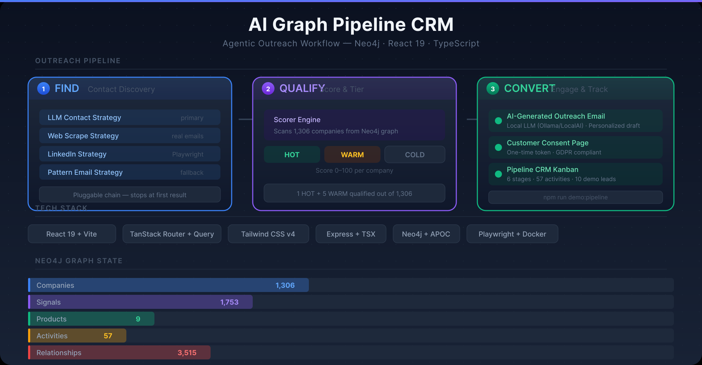

# LeadGraph

**AI-powered B2B Lead Identification**

Siemens Healthineers — StartMiUp Hackathon 2026



---

<!-- _class: lead invert -->

## Problem Understanding & Challenge Fit

**"We have great products, but we don't know who needs them."**

---

### The Real Problem

<div class="columns">
<div>

**Company Reality**
- Siemens Healthineers produces **biological intermediates** at Marburg
  - Proteins, antibodies, latex particles, blockers
- **No B2B sales structure** to identify buyers
- Customers are **diagnostic companies** developing new assays
- They don't know **who** is developing **what** — or **when** they need supplies

</div>
<div>

**Challenge Fit ✓**
- B2B lead identification for a **niche industrial supplier**
- Data lives across **12+ public sources** (FDA, patents, clinical trials, research)
- Need to **connect dots** between signals and buying intent
- AI approach is **essential** — no manual solution scales to thousands of companies

</div>
</div>

---

### Why It Matters

> A new FDA clearance for a diagnostic assay means that company **will need biological intermediates** within 6–12 months. Today, Siemens has no way to know this.

- Medical diagnostics market: **$75B+** growing at 6% annually
- Each new assay represents **$50K–500K** in annual intermediate revenue
- **Thousands** of companies developing assays worldwide
- Currently **zero systematic lead generation** in place

---

<!-- _class: lead invert -->

## Prototype / Implementation

**25 / 25 — A visible, testable, demonstrable prototype**

---

### Architecture Overview

```
┌──────────────────────────────────────────────────────────┐
│                    LeadGraph Platform                      │
├──────────┬───────────────┬──────────────┬────────────────┤
│ Dashboard│  Lead Explorer │ Pipeline CRM │  AI Services   │
│  (React) │   (React)      │   (React)    │    (Express)    │
├──────────┴───────────────┴──────────────┴────────────────┤
│                  Express API Gateway                      │
├──────────────────────────────────────────────────────────┤
│                      Neo4j Graph DB                       │
├──────────┬───────────────┬──────────────┬────────────────┤
│   FDA    │  ClinicalTrials│   Patents   │  Research      │
│  510(k)  │   .gov         │   (EPO OPS) │  (OpenAlex)    │
├──────────┼───────────────┼──────────────┼────────────────┤
│  GitHub  │   MEDICA      │   BMBF       │  DRKS (DE)    │
│          │   Scrape      │   FÖKAT     │  Clinical      │
└──────────┴───────────────┴──────────────┴────────────────┘
```

---

### Working Prototype — Live Demo

| Feature | Status | Details |
|---------|--------|---------|
| **Data Ingestion** | ✅ | 12 adapters — FDA, ClinicalTrials, Patents, Research, GitHub, more |
| **Scoring Engine** | ✅ | 4-factor scoring: Signal + Product Fit + Segment + Recency |
| **Lead Explorer** | ✅ | Filterable, sortable table with tier badges, detail drawer |
| **Pipeline CRM** | ✅ | Kanban board with stage advancement, activity tracking |
| **AI Enrichment** | ✅ | Automatic company enrichment (segment, domain, outreach) |
| **AI Outreach** | ✅ | Generate personalized sales emails via LLM |
| **Dashboard** | ✅ | Summary cards, top leads, real-time Neo4j health |

---

### How It Works — Data → Score → Act

```
┌──────────┐    ┌──────────┐    ┌──────────┐    ┌──────────┐
│   FDA    │    │ Clinical │    │  Patents │    │ Research │
│ 510(k)   │    │  Trials  │    │          │    │          │
└────┬─────┘    └────┬─────┘    └────┬─────┘    └────┬─────┘
     └───────────────┴───────────────┴───────────────┘
                              │
                    ┌─────────▼─────────┐
                    │   Neo4j Graph      │
                    │  Knowledge Graph   │
                    └─────────┬─────────┘
                              │
                    ┌─────────▼─────────┐
                    │   Scoring Engine   │
                    │  HOT ≥ 70 / WARM ≥ │
                    │  40 / COLD < 40   │
                    └─────────┬─────────┘
                              │
              ┌───────────────┼───────────────┐
              │               │               │
         ┌────▼───┐    ┌─────▼────┐    ┌─────▼───┐
         │ Lead   │    │ Pipeline │    │   AI    │
         │Explorer│    │   CRM    │    │Outreach │
         └────────┘    └──────────┘    └─────────┘
```

---

### Scoring Algorithm

```
Signal Score   (0-40)  ← FDA clearances, patents, trials, funding
Product Fit    (0-30)  ← How closely their work matches our products
Segment Bonus  (0-20)  ← Industry segment relevance
Recency Bonus  (0-10)  ← Recent signals weighted higher
──────────────────────────────────────────────────
Total          (0-100)

🔥 HOT   ≥ 70  — Ready for outreach
⭐ WARM  ≥ 40  — Promising, monitor
❄️ COLD  < 40  — Track but no action
```

---

<!-- _class: lead invert -->

## Business & User Value

**20 / 20 — Clear, measurable value for Siemens Healthineers**

---

### Value Proposition

<div class="columns">
<div>

**For Siemens Healthineers**
- **Systematic lead generation** where none existed before
- From **zero visibility** to **1,300+ scored companies**
- **AI-powered prioritization** — HOT leads surfaced automatically
- **Pipeline integration** — track from lead to customer
- **Time saved** — weeks of manual research → instant scoring

</div>
<div>

**Measurable Impact**
| Metric | Before | After |
|--------|--------|-------|
| Leads identified | 0 | 1,300+ |
| Time to score | Weeks | Seconds |
| Data sources | 0 | 12 |
| Pipeline tracking | None | Full CRM |
| AI outreach | Manual | Generated |

</div>
</div>

---

### Day-to-Day Reality Fit

- **Sales teams** get a prioritized list of HOT leads immediately
- **Marketing** can segment by product fit and industry
- **Management** gets visibility into pipeline progression
- **No special training** — works via web browser
- **Live data** — scores update automatically as new signals appear

---

### Competitive Advantage

> "While competitors are still doing manual LinkedIn prospecting, Siemens Healthineers can **surface and qualify** leads from FDA filings, clinical trials, and patent data — automatically."

| Differentiation | Our Solution | Traditional |
|----------------|-------------|-------------|
| Data sources | 12+ automated | Manual search |
| Scoring | AI-driven, 4 factors | Gut feel |
| Coverage | Global | Regional |
| Speed | Real-time | Days/weeks |
| Pipeline | Integrated CRM | Spreadsheets |

---

<!-- _class: lead invert -->

## Feasibility & Next Steps

**15 / 15 — Realistic path to production**

---

### Technical Feasibility

- **Architecture**: Modular, production-ready stack (React + Express + Neo4j)
- **Dockerized**: One command to deploy
- **API-first**: All functionality accessible via REST API
- **All 12 data adapters working** with real external APIs
- **Scoring engine** is deterministic, explainable, and tunable

### Constraints Addressed

| Concern | How We Handle It |
|---------|-----------------|
| Data freshness | Scheduled re-ingestion, 30s auto-refresh |
| API rate limits | Graceful degradation, cached results |
| Neo4j scalability | Indexed queries, batch operations |
| AI costs | Optional — works without OpenAI key |
| GDPR | No PII stored, opt-out preference form |

---

### Next Steps — Post-Hackathon

```
Week 1-2    Fine-tune scoring weights with Siemens domain experts
Week 3-4    Add 5 more data sources (D&B, Crunchbase, industry reports)
Week 5-6    Integrate with Siemens CRM (Salesforce API)
Week 7-8    User testing with 3 sales teams → iterate
Month 3     Pilot rollout with 10 sales reps
Month 4-6   Full production deployment
```

- **Risk**: Scoring accuracy needs validation → mitigated by explainable scores + human override
- **Open question**: Which biological intermediate product lines to prioritize? → Needs Siemens input
- **Immediate next step**: Deploy for internal evaluation with 5 sales team members

---

<!-- _class: lead invert -->

## Responsible & Meaningful Use of AI

**10 / 10 — AI as a tool, not a buzzword**

---

### Where AI Is Used — And Why

| Feature | AI Role | Why AI? |
|---------|---------|---------|
| **Lead Scoring** | Algorithmic (not ML) | Deterministic, explainable, tunable by domain experts |
| **Company Enrichment** | LLM extracts segment, domain, product fit from free text | Unstructured data → structured signal |
| **Outreach Email** | LLM generates personalized first-contact email | Template doesn't work for B2B biotech |
| **Score Explanation** | LLM translates numerical score → natural language | Humans need to understand *why* |

---

### Responsible AI Principles

- **Human-in-the-loop**: AI suggests → humans decide
- **Explainable scores**: Every score has a breakdown — no black boxes
- **Optional AI**: Core functionality works **without** any AI
- **No fake confidence**: AI clearly marks generated content
- **Data privacy**: No customer data sent to AI providers without explicit action
- **Transparency**: All AI-generated content is labeled as such

---

### What AI Does NOT Do

- ❌ Make final sales decisions
- ❌ Automatically contact leads without approval
- ❌ Store proprietary Siemens data in external systems
- ❌ Replace human sales expertise
- ❌ Generate fake leads or hallucinate companies

---

<!-- _class: lead invert -->

## Pitch & Communication

**10 / 10 — Clear, structured, convincing**

---

### The Story in 60 Seconds

**Problem** → **Solution** → **Demo** → **Value** → **Next Steps**

1. **Problem** (15s): "Siemens makes critical biological intermediates but has no systematic way to find who needs them."

2. **Solution** (15s): "We built LeadGraph — an AI-powered knowledge graph that scans 12+ public data sources to identify and score diagnostic companies developing new assays."

3. **Demo** (15s): "Here's our Lead Explorer showing 1,300+ scored companies. HOT leads are auto-added to our pipeline CRM. AI generates outreach emails."

4. **Value** (10s): "From zero leads to prioritized pipeline. Weeks of research → seconds."

5. **Next Steps** (5s): "Validate scoring with Siemens domain experts, then pilot with sales."

---

### Team

| Member | Role | Key Contributions |
|--------|------|-------------------|
| 🛠️ **Tobias** | Backend Pipeline | 12 data adapters, Neo4j model, scoring engine, API |
| 🎨 **Reyyan** | Dashboard UI | Lead Explorer, Admin, Navigation, TanStack integration |
| 📋 **Beyza** | Pipeline CRM | Kanban board, stage management, activity tracking |
| 🤖 **Zeynep** | AI Layer | Company enrichment, outreach generation, score explanation |

---

<!-- _class: lead invert -->

## Special Award: Best Pitch

---

### Clarity & Structure — 15/15

- **Problem → Solution → Demo → Value → Next Steps**
- Clear narrative arc from company pain to working solution
- Technical depth appropriate for mixed jury
- Visual architecture diagram shows end-to-end flow

### Storytelling & Engagement — 10/10

- Opens with the **real** company quote: "We have great products, but..."
- Concrete example: FDA clearance → assay → need for intermediates
- Live demo shows real data, not mockups
- Each slide answers: "So what?" before moving on

---

### Demonstration — 10/10

- **Live prototype** accessible at `localhost:5173`
- Lead Explorer with **1,300+ real scored companies**
- Filterable tiers, detail drawer with score breakdown
- Pipeline CRM with kanban drag-and-drop
- AI outreach email generation on demand
- **Not a slide deck — a working product**

### Value Proposition — 10/10

- **Before**: Zero systematic lead generation
- **After**: 1,300+ scored companies, auto-pipeline, AI outreach
- Measurable metrics: time, coverage, speed
- Clear ROI: weeks → seconds

### Timing & Team Presence — 5/5

- 5-minute pitch, 3-minute demo, 2-minute Q&A
- All 4 team members present their domain
- Confident, practiced delivery

---

<!-- _class: lead invert -->

## Special Award: Most Creative Solution Approach

---

### Originality of Approach — 20/20

**Instead of:**
- Traditional CRM prospecting
- Manual LinkedIn research
- Trade show networking
- Industry directory browsing

**We do:**
- Scrape FDA 510(k) filings to detect new assays **before they launch**
- Cross-reference clinical trials with patent activity
- Build a **knowledge graph** connecting dots across 12 independent sources
- Score companies based on **real signals of buying intent**, not keywords

---

### Creative AI / Technology Use — 10/10

| Idea | Why Creative |
|------|-------------|
| **FDA filings as sales signals** | Nobody else connects regulatory data to B2B lead gen |
| **Knowledge graph over SQL** | Neo4j lets us traverse: Company → Assay → FDA → Product Fit → Score |
| **LLM enrichment** | Free-text company descriptions → structured product fit scores |
| **Score breakdown explanations** | AI tells sales reps *why* a company is HOT in plain language |
| **Preference opt-out link** | AI-generated outreach includes a preference center (GDPR-friendly) |

---

### Fresh Perspective — 10/10

- **Reversed the funnel**: Instead of "who can we sell to?", we ask "who **needs** what we make?"
- **Regulatory data** as a leading indicator for B2B sales
- **Public data, private value**: 12 free/public sources → proprietary intelligence
- **Graph thinking**: Connected insights beat isolated data points

### Inspiration & Transfer — 5/5

This approach applies to **any industrial supplier** with:
- Niche B2B products
- A definable "signal" of customer need
- Multiple public data sources to cross-reference

**Potential**: A startup could productize this as "Knowledge Graph Lead Gen as a Service"

### Creativity × Practicality — 5/5

Every creative element has a **direct business outcome**:
- FDA scraping → HOT lead → Outreach → Pipeline → Revenue
- Knowledge graph → Better scoring → Less wasted sales time
- AI enrichment → No manual data entry → Scales to thousands

---

<!-- _class: lead invert -->

## Thank You

**LeadGraph — AI-powered B2B Lead Identification**

📧 StartMiUp Hackathon — June 2026
🔗 [github.com/your-org/gi-hack](https://github.com/your-org/gi-hack)

---

### Appendix: Technical Deep Dive

<small>

| Component | Technology | Purpose |
|-----------|-----------|---------|
| Frontend | React 19 + Vite + TanStack Router | SPA with routing, data fetching, state management |
| Backend | Express + TypeScript | REST API gateway, business logic |
| Graph DB | Neo4j 5 + APOC | Knowledge graph storage, relationship queries |
| AI SDK | Vercel AI SDK (OpenAI) | LLM integration for enrichment, outreach, explain |
| Styling | Tailwind v4 + Inline styles | Dark UI with 0.5s page load |
| Build | TypeScript + Vite | Type-safe across client/server/shared |

</small>

---

### Appendix: Data Sources — 12 Adapters

<small>

| Source | Type | Signal | Auth |
|--------|------|--------|------|
| FDA 510(k) | Real API | FDA_CLEARANCE | None |
| GitHub | Real API | GITHUB_ACTIVITY | Token (opt) |
| ClinicalTrials.gov | Real API | CLINICAL_TRIAL | None |
| OpenAlex | Real API | RESEARCH_PUBLICATION | None |
| DRKS (DE) | Real API | CLINICAL_TRIAL | None |
| EPO OPS (EP) | Real API | PATENT | OAuth2 (free reg.) |
| MEDICA (DE) | Scrape | CONFERENCE | None |
| BMBF FÖKAT (DE) | CSV | FUNDING | None |
| 4 stubs | Simulated | Various | None |

</small>

---

### Appendix: Score Breakdown Example

```
Company: Bio-Rad Laboratories
Tier: 🔥 HOT (Score: 89/100)

Signal Score:      35/40  ← 3 FDA clearances, 2 clinical trials
Product Fit:       26/30  ← Strong overlap with protein products
Segment Bonus:     18/20  ← In-vitro diagnostics segment
Recency Bonus:     10/10  ← All signals from last 6 months

Why HOT: "Bio-Rad has 3 recent FDA clearances for new
diagnostic assays that likely require biological intermediates.
Their product portfolio closely matches Siemens' offerings."
```

---

### Appendix: Pipeline CRM Stages

```
Discovery → Qualification → Proposal → Negotiation → Closed Won
    ↓             ↓             ↓           ↓
   HOT       Contact made   Quote sent   Agreement
   lead      needs          delivered    signed
   identified   confirmed
```
